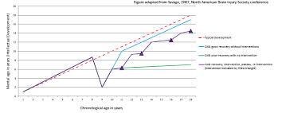
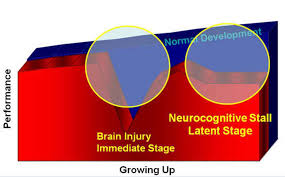
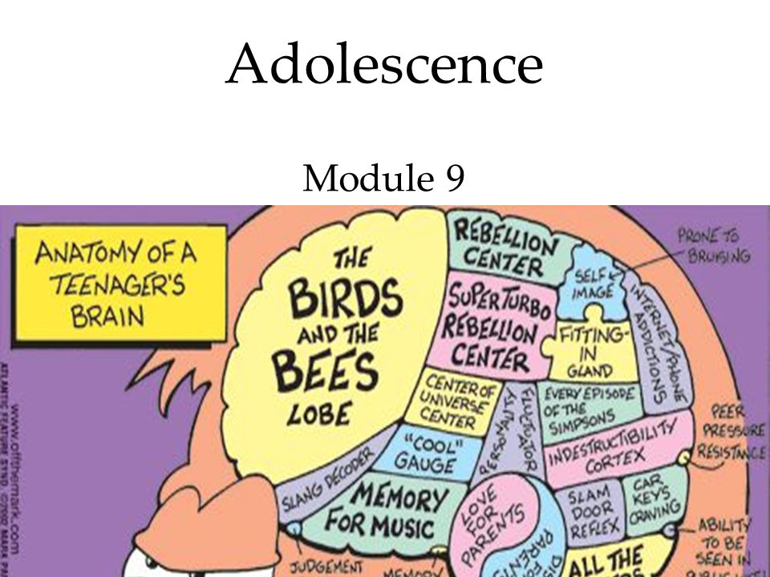
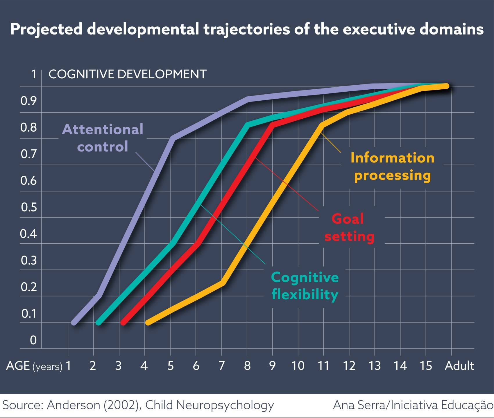
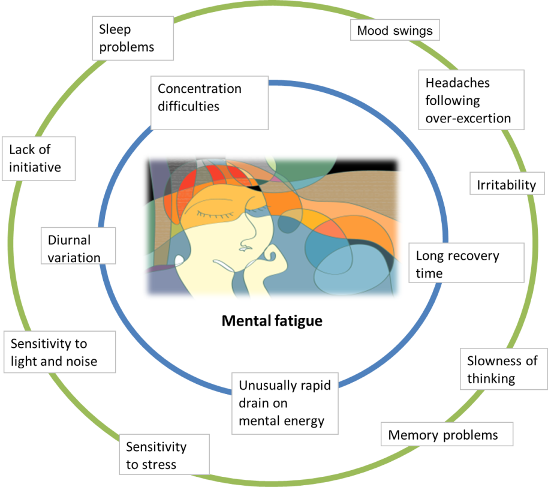
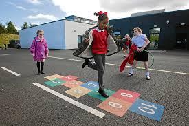

background-image: url(logo.png)
background-position: top right
background-size: 250px 130px
layout: true
---

class:

# Header 1

## Header 2

### Header 3

#### Header 4

1. Bullet 1
2. Bullet 2

This is the first paragraph. This is the first paragraph. This is the first paragraph. This is the first paragraph. This is the first paragraph. This is the first paragraph.

----

Here is a <a href="">link</a>

.footnote[
Here is a footer with a <a href="">link</a>
]

---
layout: false
class: inverse

# Header 1

## Header 2

### Header 3

#### Header 4

1. Bullet 1
2. Bullet 2

This is the first paragraph. This is the first paragraph. This is the first paragraph. This is the first paragraph. This is the first paragraph. This is the first paragraph.

----

Here is a <a href="">link</a>

.footnote[
Here is a footer with a <a href="">link</a>
]

---
name: about-me
class: about-me-slide, right, middle, center
background-image: url(img/salford.jpg)
background-position:-5% 50%
background-size: 425px 100%

## Chris Gaskell

## Clinical Psychologist

.fade[Non-Epileptic Attack Disorder Service Northern Care Alliance NHS Foundation Trust Manchester, UK]

[`r icons::fontawesome("link")` chris-gaskell.com](https://chris-gaskell.com)
[`r icons::fontawesome("twitter")` @chris-gaskell92](https://twitter.com/chris-gaskell92)
[`r icons::icon_style(icons::fontawesome("github"), scale = 1)` @chris-gaskell](https://github.com/chris-gaskell)

???
- Introduction
- How I got into this.

---
class: left
background-image: url(https://images.unsplash.com/photo-1503454537195-1dcabb73ffb9?ixlib=rb-1.2.1&ixid=MnwxMjA3fDB8MHxzZWFyY2h8MXx8Y2hpbGR8ZW58MHx8MHx8&auto=format&fit=crop&w=400&q=60)
background-position: 100% 0%
background-size: 40% 100%

#  What to Expect 

.large[
+ Introduction & Hopes
+ What is brain injury:
+ What is it?
+ Causes of brain injury
+ What is the impact?
+ The neuropsychological aspects
+ Community rehabilitation
+ Your questions:
]

---
class: inverse, middle, center

# What is brain injury?

---
background-image: url(logo.png)
background-position: top right
background-size: 250px 130px
layout: true
---
class: left
background-image: url(assets/img/image3.jpeg)
background-position: 100%
background-size: contain

#  Causes of  Brain Injury 

---
class:
background-image: url(assets/img/image4.jpeg)
background-position: 50% 50%
background-size: 100% 100%

---
#  Primary difficulties resulting from brain injury 

+ Education
	+ Missed learning due to hospitalisation.
	+ Not reaching ARE.
	+ Masking of difficulties
	+ Academic potential may not be reached
	+ Independence
	+ Over-reliance on adults.
	+ Loss of skills.
	+ Retention of new learning.
	+ Lack of confidence.
	+ Social skills and relationships
	+ Emotional
	+ Self esteem
	+ Frustration
	+ Anxiety
	+ Emotional dysregulation
	+ Social
	+ Difficulties unrecognized (invisible difficulty).
	+ Visible difference.
	+ Skills for making and managing relationships
	+ Vulnerability
	+ Difficulty with behaviour
	+ Problems with thinking skills
	+ Memory (short term, long term, working memory).
	+ Executive functions (more later).
	+ Paying attention.
	+ Lack of insight.
	+ Word finding difficulties.
	+ Visual problems
	+ Empathy and understanding others’ POV
	+ Physical & Medical
	+ Hearing Impairment
	+ Fine motor problems: poor handwriting
	+ Gross motor problems: mobility, balance, co-ordination.

---
#  Developmental trajectory and outcomes 

Neuropsychological (executive processes) difficulties are also associated with difficulties in:
Academic attainment - maths , literacy
Emotion regulation – high prevalence of depression/anxiety
Behavioural regulation – high prevalence of aggression/conduct
Social communication
Social participation – Family burden/stress
Future independence in adulthood, future employment, risk of crime, risk of substance use, risk of mental health difficulties etc
Around 50% of offenders report to have a previous ABI. Could be as high as 70%
Suicide risk peaks 5-7 years post-injury.
.pull-left[]

.pull-right[]

---
#  Plasticity vs. Vulnerability 

‘Derails’ normal development as the brain continues to mature in the context of an injury.
Deficits can emerge over time, as different cognitive functions come online
( e.g., executive functions associated with the frontal lobes continue to develop into early adulthood).
.pull-left[]

.pull-right[]

---
#  Long term - Impact on life 

School attendance and engagement:
60% do poorly at school (Sariaslan et al, 2016)
Exclusions/ alternative provision
Criminal justice system (Williams et al, 2010 & 15)
Jobs, qualifications and future welfare:
Less likely to progress to future study/work.
80% more likely to receive disability benefits and 60% welfare benefits  (Sariaslan et al., 2016).
More likely to be homeless (e.g., 48% in Leeds had a history of ABI; Disabilities Trust, 2010).
Mental Health:
overrepresentation of psychiatric conditions (Li & Liu, 2013)
Similar levels of mental health difficulties as CYP referred to CAMHS (Gracey & Watson, 2014)
Social Adjustment, isolation & relationships:
Many people with ABI report poor quality of life (Anderson et al, 2010)
Poorer social adjustment, participation and greater social problems (Anderson et al, 2014)

---

---
#  What are neuropsychological difficulties? 

+ There is a large, diverse range of thinking skills/processes that we all have.
	+ Many of these thinking skills can be grouped (called domains).
Memory
Language
Perception
Proprioception
Attention
Intelligence
Interoception
Executive functioning
Cognitive Groups
.pull-left[]

.pull-right[]

---
#  EF is an umbrella term to describe a group of processes that contribute to the execution of purposeful and goal directed behavior. A bit like an executive in a company supervising complex and novel tasks. 

Executive Functioning
Working Memory
Being able to hold information mind and manipulate it purposefully.
Required for: Arithmetic, holding multiple instructions
Planning
Being able to plan a series of steps to complete a task and employ effective strategies.
Required for: Project work, large self-directed tasks
Inhibition
Being able to resits urges and impulses.
Required for: interpersonal skills, tasks requiring careful consideration, appropriate behaviour, prolonged concentration
Self Monitoring
Being able to observe own performance to guide subsequent behaviour.
Required for: Problem solving
Set Shifting
Being able to adjust to new thinking when old thinking is not successful.
Required for: Problem solving
Regulation
Being able to monitor and manage emotions and behaviour.
Required for: Managing social demands and school pressures (essentially everything)

---
#  Executive Functioning 

Particularly vulnerable to injury
Develop throughout childhood and adolescence
Two main areas:
Ventrolateral cortex: emotional and behavioural regulation
Dorsolateral cortex: working memory, planning, organisation
.pull-left[]

.pull-right[]

---
#  What might be signs of EF difficulty? 

Forgets to complete ad-hoc homework task.
Difficulty with complex/novel work that requires planning and switching tasks.
Difficulty staying on task (particularly uninteresting tasks).
Poor time management.
Impulsive behavior and difficulty regulating emotions.
When stuck on a problem unable to think of alternative solutions.
Regular difficulty with peers.
Not able to utilize feedback.
Highly repetitive behaviors.
Difficulty with motivation and self-direction.
.pull-left[]

.pull-right[]

---
#  Difficulties with Fatigue 

Fatigue is different to being tired.
It can be physical and mental fatigue and impacts upon cognitive functioning.
Fatigue needs to be managed by:
Taking regular breaks, either physical or mental rest.
Not overloading with information.
Embedding breaks into the daily routine.
Understanding triggers for fatigue
.pull-left[]

.pull-right[]

---

---
#  Ask children what they want(McCarron et al, 2019) 

.pull-left[]

.pull-right[]

---
#  Holistic approach 

+ Rehabilitation psychology: Goal = optimising wellbeing and meaningful participation for individuals with disabilities in daily living (Dunn Ehde & Wegener, 2016)
	+ Occupational therapy: Identifying impairments on everyday, functional activities and working to help children overcome their difficulties and regain independence.
How do we do this?
+ Neuropsychological intervention: cognitive, behavioural, social, emotional applications.
	+ OT intervention: to introduce strategies/ adaptations to everyday activities, including education.
	+ Ecological rehab integrated into daily routines – appropriate to age and stage of brain development (e.g., Braga, 2016).
	+ Within the meaningful setting of the family (shape relationships).
	+ Empower families with knowledge.
	+ Realistic expectations: short and long-term goals that are relevant to the specific child.
	+ Focus on potential and successes, not losses.
	+ Work between community, school and home: promoting consistent rehabilitation wherever possible.
	+ Plan for the future (prognosis for abilities > employment and social integration)

---
#  Education after Brain Injury 

Schools are a crucial part to rehabilitation however limited training provided for teachers about ABI: unsure how to support despite having skills and experience.
Student can find it hard to process information.
They find the curriculum demands very tiring.
May have no idea where to start, especially if lots of instructions.
Working without frequent prompts and guidance is difficult.
May appear to not be trying - don’t use ‘obvious’ strategies such as turning to the page before.
May have limited ability to draw on prior knowledge.
Can be very literal and need very clear expectations.
May be reluctant to ask for help and keen to be like their peers.
Social and emotional issues become more apparent in teenage years.
Inappropriate behaviour:
Impulsivity and lack of control - may be labelled as ‘naughty’/’challenging’ when they have reduced control or are acting out of distress or lack of understanding
Lack of initiation or empathy may be seen as ‘lazy’ or thoughtless
.pull-left[]

.pull-right[]

---

[chris@indigoneuro.co.uk](http://www.childbraininjurytrust.org.uk/)
[www.childbraininjurytrust.org.uk](mailto:chris@indigoneuro.co.uk)
[http://www.braininjuryhub.co.uk/](http://www.headway.org.uk/)
[www.biausa.org/brain-injury-children.htm](http://www.biausa.org/brain-injury-children.htm)
[www.headway.org.uk](http://www.braininjuryhub.co.uk/)
